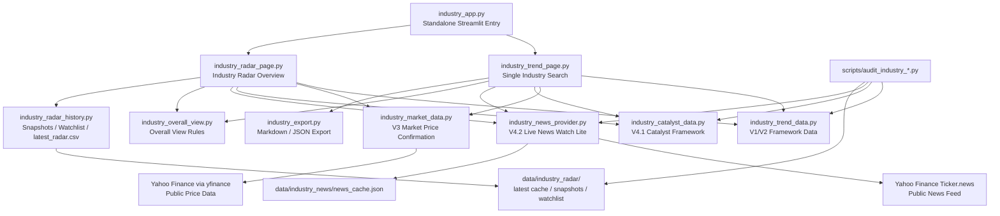

# System Architecture

## 总览

Industry Trend Search Engine 采用本地 Streamlit 应用结构。页面层、数据层、计算层、导出层和 audit 层分离，便于后续替换真实数据源或扩展行业覆盖。

## 模块关系

## 入口层

### `industry_app.py`

独立行业趋势搜索引擎入口。它只渲染：

- 单行业搜索
- 行业雷达总览

它不显示原 dashboard 侧边栏，也不修改 `app.py`。

## 页面层

### `src/industry_trend_page.py`

负责单行业页面：

- 搜索框和识别结果
- 综合判断卡
- 趋势摘要
- 框架评分
- V3 市场价格确认摘要与明细
- V4.1 新闻热度与催化事件
- V4.2 实时新闻观察
- 产业链与风险信号
- Guide expander
- 导出分析上下文

### `src/industry_radar_page.py`

负责行业雷达总览：

- 核心雷达表
- 分类、状态、搜索、watchlist 筛选
- 高级指标
- 图表
- 历史快照与导出
- 数据更新与维护
- Guide 与开发者信息

## 数据与计算层

### `src/industry_trend_data.py`

行业基础框架数据。包含：

- 行业名称与 alias
- 趋势状态
- 趋势阶段
- 框架评分
- key drivers
- sub-sectors
- industry chain
- catalysts
- risk signals

### `src/industry_market_data.py`

V3 市场价格确认模块。职责：

- 管理行业 ticker proxy mapping
- 下载公开价格数据
- 计算 MA20 / MA50 / MA200 breadth
- 计算 1M / 3M / 6M return
- 计算 median 3M return 和 relative strength
- 计算 Market Price Confirmation Score，最高限制 9.5
- 区分 no market mapping 和 market data failed

### `src/industry_catalyst_data.py`

V4.1 本地催化事件框架。职责：

- 维护全行业 heat score
- 维护 heat level 和 heat direction
- 维护 catalyst events
- 提供中英文字段
- 提供 catalyst guide 字典

### `src/industry_news_provider.py`

V4.2 轻量真实新闻观察。职责：

- 使用 yfinance ticker news
- 本地 JSON 缓存
- 去重
- 关键词匹配
- relevance 过滤
- TTL freshness 判断
- 手动刷新

### `src/industry_overall_view.py`

综合判断规则模块。输入框架分、价格确认分、新闻热度、估值压力、基本验证和 MA50 breadth，输出：

- Overall status
- Priced-in risk
- Key tags
- One-line view

### `src/industry_export.py`

导出模块。负责：

- 构建 export context
- 生成 Markdown
- 生成 JSON
- 中文 Markdown label 本地化
- 中文 catalyst 字段优先读取

## 缓存与本地数据

### `data/industry_radar/`

- `latest_radar.csv`
- `radar_snapshot_YYYY-MM-DD.csv`
- `watchlist.json`

### `data/industry_news/`

- `news_cache.json`

页面默认读取缓存，不自动全量刷新网络数据。刷新动作集中在手动按钮中。

## Audit Scripts

### `scripts/audit_industry_trend_data.py`

检查行业字段完整性、中文字段、英文残留、alias 歧义和 market mapping 状态。

### `scripts/audit_industry_catalyst_data.py`

检查 V4.1 catalyst data 是否覆盖全行业，字段和枚举是否完整。

### `scripts/audit_industry_news_provider.py`

检查 V4.2 news provider schema、cache helper、ticker limit 和 relevance 字段。

### `scripts/audit_industry_semantic_quality.py`

检查字段完整但语义不合理的问题，例如消费行业残留科技制造模板词。
